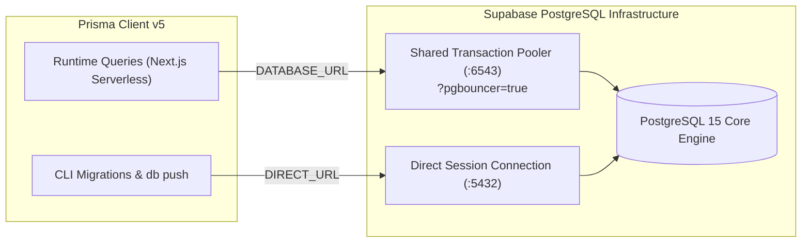

# 03 — Arsitektur Basis Data & Object Storage

> **Dokumen**: `Dokumentation/03_DATABASE_AND_STORAGE.md`  
> **Database Engine**: PostgreSQL 15+ (Hosted on Supabase AWS Singapore `ap-southeast-1`)  
> **ORM Layer**: Prisma Client v5  
> **Object Storage**: Supabase Storage Bucket `portofolio` (Public Access)  

---

## 1. Konfigurasi Dual-Connection PostgreSQL

Prisma beroperasi menggunakan dua URL koneksi terpisah dalam [prisma/schema.prisma](file:///e:/Portfolio/prisma/schema.prisma) untuk mengatasi karakteristik *serverless* Next.js dan *PgBouncer connection pooler*:



1. **`DATABASE_URL` (Port 6543 - Transaction Pooler)**:
   * Menggunakan flag `?pgbouncer=true`.
   * Mencegah kehabisan koneksi (*connection exhaustion*) saat puluhan fungsi serverless Next.js berjalan simultan.
2. **`DIRECT_URL` (Port 5432 - Direct Session Connection)**:
   * Mengarahkan perintah skema seperti `npx prisma db push` langsung ke sesi PostgreSQL native untuk memodifikasi tabel, indeks B-Tree, dan constraint foreign key tanpa gangguan *transaction-mode pooling*.

---

## 2. Skema Model Data Relasional (`prisma/schema.prisma`)

```prisma
datasource db {
  provider  = "postgresql"
  url       = env("DATABASE_URL")
  directUrl = env("DIRECT_URL")
}

generator client {
  provider = "prisma-client-js"
}

// 1. Akun Admin CMS
model User {
  id            String    @id @default(cuid())
  name          String?
  email         String?   @unique
  emailVerified DateTime?
  image         String?
  role          String    @default("ADMIN")
  createdAt     DateTime  @default(now())
  updatedAt     DateTime  @updatedAt
}

// 2. Data Singleton Profil & Biodata Publik (id: 1)
model Profile {
  id           Int      @id @default(1)
  name         String   @default("Zola Dimas Firmansyah")
  avatarUrl    String?
  location     String   @default("Yogyakarta, Indonesia")
  heroTitle    String   @default("Systems Architect & Backend Engineer")
  heroSubtitle String   @default("Specializing in Distributed Systems, UML Modeling, and PostgreSQL Optimization")
  aboutText    String   @db.Text
  emailContact String   @default("zoladimas32@gmail.com")
  githubUrl    String?  @default("https://github.com/zoladimas")
  linkedinUrl  String?  @default("https://linkedin.com/in/zoladimas")
  resumeUrl    String?  @default("/cv-zola-dimas.pdf")
  updatedAt    DateTime @updatedAt
}

// 3. Entitas Proyek Rekayasa & Blueprint Arsitektur
model Project {
  id          String         @id @default(cuid())
  title       String
  slug        String         @unique
  description String         @db.Text
  thumbnail   String?
  gallery     String[]       @default([])
  documentUrl String?        // URL berkas SRS / Dokumen Teknis PDF
  videoUrl    String?
  techStack   String[]
  liveUrl     String?
  repoUrl     String?
  completedAt DateTime?
  isPublished Boolean        @default(true)
  createdAt   DateTime       @default(now())
  updatedAt   DateTime       @updatedAt
  clickTracks ClickTracker[]

  @@index([slug])
  @@index([isPublished])
}

// 4. Log Telemetri Klik Outbound (Asinkron)
model ClickTracker {
  id        String   @id @default(cuid())
  projectId String
  project   Project  @relation(fields: [projectId], references: [id], onDelete: Cascade)
  userAgent String?
  ipAddress String?
  country   String?
  clickedAt DateTime @default(now())

  @@index([projectId])
  @@index([clickedAt])
}
```

### Karakteristik Relasi & Integritas Data:
* **Cascade Deletion (`onDelete: Cascade`)**: Ketika admin menghapus record `Project`, seluruh record telemetri `ClickTracker` yang berelasi akan dibersihkan secara otomatis oleh engine PostgreSQL guna menjaga konsistensi referensial tanpa menyisakan data yatim (*orphan data*).
* **Indeks Komposit & Kinerja**:
  * Indeks pada kolom `slug` dan `isPublished` menjamin query filter di beranda publik berjalan di bawah **5ms**.
  * Indeks pada kolom `projectId` dan `clickedAt` mempercepat agregasi grafik telemetri pada dashboard CMS.

---

## 3. Arsitektur Supabase Object Storage

Penyimpanan berkas dikelola melalui bucket **`portofolio`** berstatus **Public Access**:

```text
Supabase Storage Bucket: 'portofolio'
├── projects/              # Gambar cover visual & galeri screenshot arsitektur
├── documents/             # Berkas spesifikasi teknis / SRS dokumen (PDF/DOCX)
├── profile/               # Avatar Zola Dimas Firmansyah
└── resume/                # Berkas Curriculum Vitae / Resume teknis
```

### Aturan & Kebijakan Storage:
1. **Public Read**: Seluruh aset gambar dan dokumen dapat diakses secara publik tanpa token sementara melalui URL:
   `https://[PROJECT_REF].supabase.co/storage/v1/object/public/portofolio/[FOLDER]/[FILE_NAME]`
2. **Authenticated / Service Role Write**: Mutasi unggah berkas dilakukan melalui Route Handler `/api/upload` yang memvalidasi sesi admin dan menggunakan `SUPABASE_SERVICE_ROLE_KEY` melalui helper singleton [lib/supabase.ts](file:///e:/Portfolio/lib/supabase.ts).
3. **Batas Ukuran**: Maksimal 10 MB per berkas.

---

## 4. Prosedur Operasional Database

```bash
# 1. Sinkronisasi skema Prisma ke database Supabase (Non-Destructive)
npm run db:push

# 2. Inisialisasi ulang data awal (Profile Singleton & Proyek Sampel)
npm run db:seed

# 3. Uji koneksi langsung dan pemeriksaan latensi
npm run healthcheck
```
