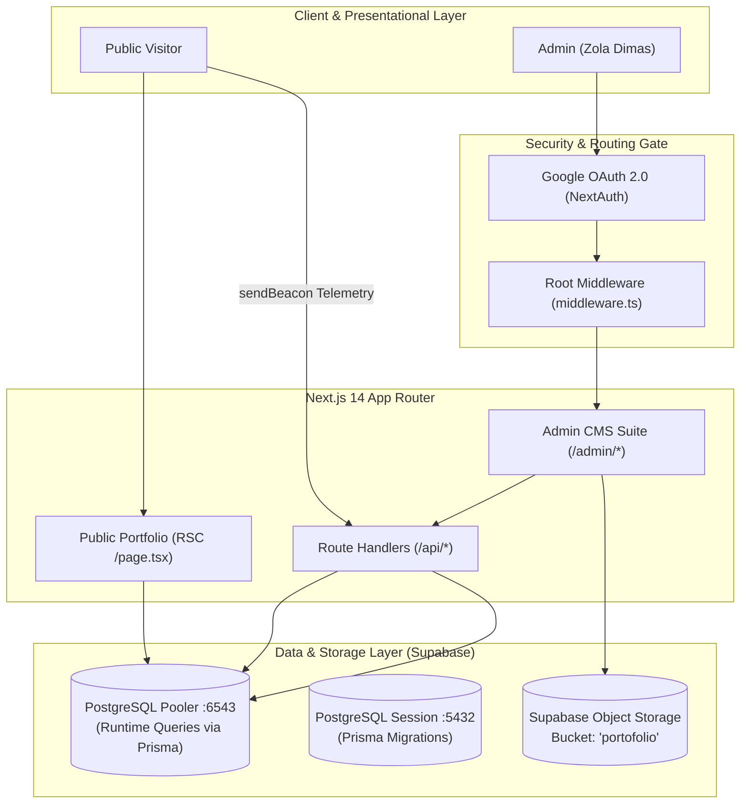

# 🚀 High-Performance Portfolio & Architecture CMS
### Systems Architecture • Distributed PostgreSQL • Software Requirements & Formal UML

[](https://nextjs.org/)
[](https://www.typescriptlang.org/)
[](https://tailwindcss.com/)
[](https://www.prisma.io/)
[](https://supabase.com/)
[](https://next-auth.js.org/)
[-success?style=flat-square)](https://github.com/)

A modern, full-stack personal portfolio and Content Management System (CMS) engineered for **Zola Dimas Firmansyah**. Features an elegant *Obsidian Precision* dark aesthetic, React Server Components (RSC) with zero-runtime client bundle overhead for static views, Supabase PostgreSQL with transaction pooling, an asynchronous telemetry click tracker daemon, and a Google OAuth-protected administrative dashboard.

---

## 🌟 Key Architecture Highlights

* **Server-First Rendering**: Built on Next.js 14 App Router. Presentational pages are rendered as React Server Components (RSC) directly connected to PostgreSQL for sub-millisecond edge delivery and search engine discoverability.
* **Dual-Connection PostgreSQL Architecture**:
  * **Runtime Pooling (Port 6543)**: Shared transaction-mode PgBouncer connection to prevent connection exhaustion in serverless runtimes.
  * **Session Migration (Port 5432)**: Direct PostgreSQL connection used by Prisma CLI for schema synchronization.
* **Full CMS Administration Suite**:
  * Complete CRUD and inline editing for Projects, Technical Specifications (SRS PDF), Cover Visuals, Skills Arsenal, Career Milestones, and Profile Biodata.
  * Multi-file Supabase Storage object upload handling up to 10MB per document/asset.
* **Non-Blocking Telemetry Pipeline**:
  * Outbound links are tracked via `<TrackedLink>` using `navigator.sendBeacon` and high-throughput Route Handlers. Click tracking is asynchronous (*fire-and-forget*) and never blocks browser navigation.
* **Obsidian Precision Design System**: Curated dark palette (`#030712`, `#0b0f17`), micro-animations, radial glow borders, and clean typography powered by Google Font **Inter**.
* **100% Test Automation Coverage**: 61 end-to-end integration test scenarios (26 frontend viewport tests + 35 backend API tests) passing continuously.

---

## 🏗️ System Architecture Flow



---

## 📁 Repository Structure

```text
├── app/
│   ├── (public)/              # Public portfolio homepage & layout
│   ├── admin/                 # CMS: Dashboard HUD, Projects, Skills, Timeline, Profile
│   └── api/                   # REST API Handlers (Health, Projects, Profile, Telemetry, Upload)
├── components/                # Reusable UI components & Obsidian Precision dialogs
├── lib/                       # Singletons: Prisma client, Supabase storage, NextAuth config
├── prisma/
│   ├── schema.prisma          # PostgreSQL relational data models
│   └── seed.mjs               # Seed script for initial records
├── tests/                     # Automated test suites (38 passing scenarios)
│   ├── frontend-automation.test.mjs
│   ├── backend-automation.test.mjs
│   └── test-connection.mjs
└── Dokumentation/             # Official technical documentation & architecture manuals
```

---

## ⚡ Quick Start

### Prerequisites
* **Node.js**: v18.17+ or v20+ LTS
* **Package Manager**: `npm`
* **PostgreSQL & Supabase Storage**: Supabase project credentials

### 1. Clone & Install
```bash
git clone https://github.com/zoladimas/portfolio.git
cd portfolio
npm install
```

### 2. Environment Configuration
Copy the template environment file:
```bash
cp .env.example .env
```
Fill in your Supabase connection strings, Supabase storage keys, and Google OAuth credentials in `.env`.

### 3. Database Synchronization & Seeding
```bash
# Push Prisma schema to PostgreSQL
npm run db:push

# Populate initial profile and sample project records
npm run db:seed

# Verify infrastructure connection health
npm run healthcheck
```

### 4. Run Development Server
```bash
npm run dev
```
Open [http://localhost:3000](http://localhost:3000) to view the public portfolio, or [http://localhost:3000/admin/login](http://localhost:3000/admin/login) for the administrative CMS.

---

## 🧪 Automated Testing Suite

The repository includes a comprehensive 61-scenario automated integration test suite:

```bash
# Run all tests (Frontend + Backend - 61 Scenarios)
npm run test:all

# Run frontend viewport & CMS authentication tests (26 Scenarios)
npm test

# Run backend REST API, CRUD & Telemetry tests (35 Scenarios)
npm run test:backend

# TypeScript strict type check
npx tsc --noEmit
```

---

## 📖 Official Technical Documentation

Comprehensive architectural blueprints and developer guides are located in the [Dokumentation/](./Dokumentation) directory:

* [00 — System Overview & Architecture Diagram](./Dokumentation/00_OVERVIEW_AND_ARCHITECTURE.md)
* [01 — Frontend Architecture & Obsidian Design System](./Dokumentation/01_FRONTEND_ARCHITECTURE.md)
* [02 — Backend Architecture & REST API Reference](./Dokumentation/02_BACKEND_AND_API_REFERENCE.md)
* [03 — Database Schema & Supabase Object Storage](./Dokumentation/03_DATABASE_AND_STORAGE.md)
* [04 — Developer & Production Deployment Guide](./Dokumentation/04_DEVELOPER_GUIDE_AND_OPERATIONS.md)

---

## 👤 Author

**Zola Dimas Firmansyah**  
*Systems Architect & Backend Engineer*  
* Email: [zoladimas32@gmail.com](mailto:zoladimas32@gmail.com)  
* GitHub: [@zoladimas](https://github.com/zoladimas)  
* LinkedIn: [Zola Dimas Firmansyah](https://linkedin.com/in/zoladimas)  

---

## 📄 License

This project is licensed under the [MIT License](LICENSE).
